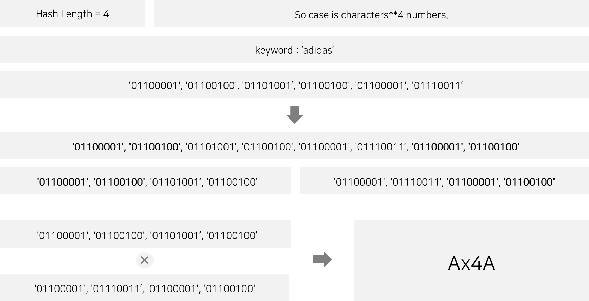

## Hash

##### Our hash code generator

***

### Installation

```code
pip3 install Hash-master/
```

***

### Projects

Now, we make the hashXOR generator.

the notions are below.




***

### Examples

* Script
```python3
from Hash import HashXOR
hxor = hashXOR()
print(h4.digest('adidas', 4))
```
* Outputs
```python
Ax4A
```

***


### Notices

###### Unauthorized distribution and commercial use are strictly prohibited without the permission of the original author and the related module.